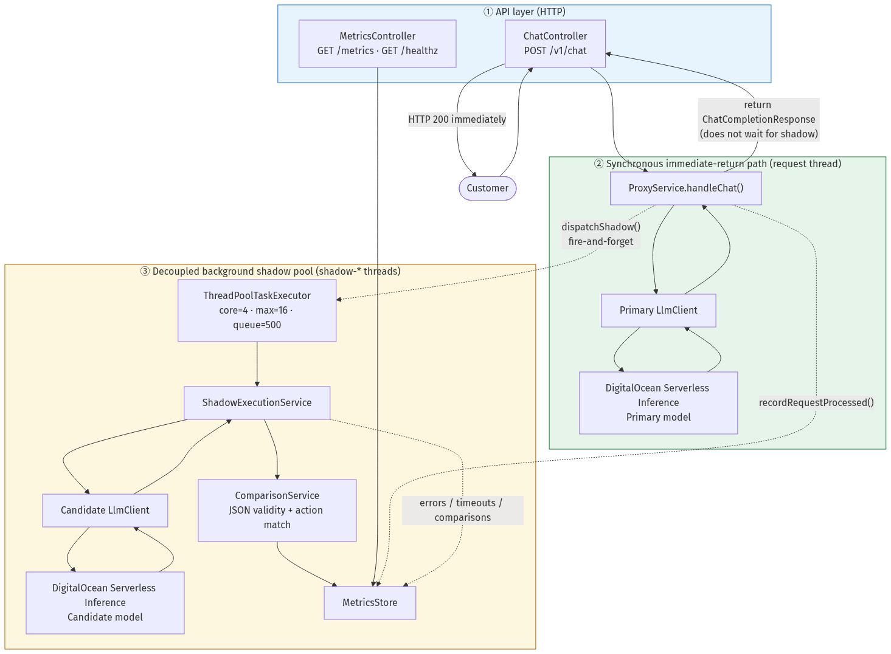
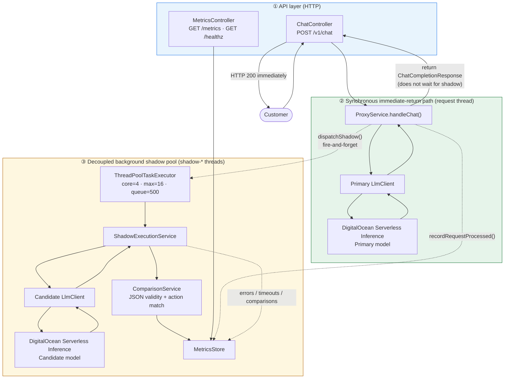
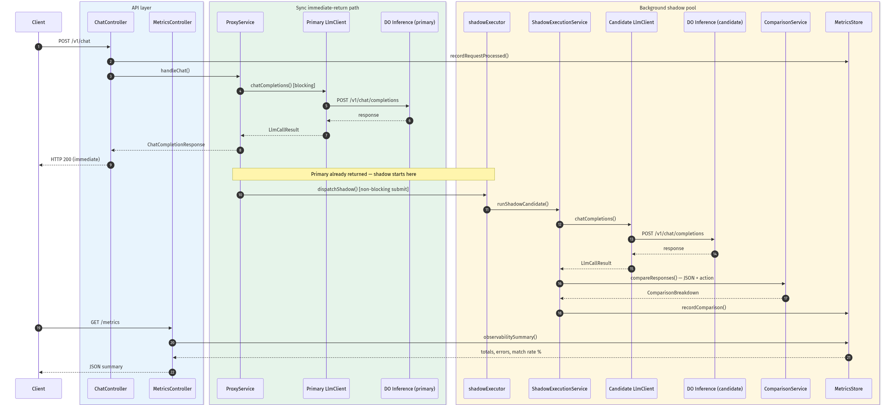
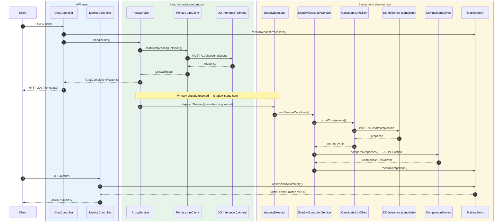

# LLM Proxy — Primary + Candidate Shadow (Java / Spring Boot)

Production-ready API proxy that serves customer traffic through a **primary** [DigitalOcean Serverless Inference](https://cloud.digitalocean.com/model-studio/serverless-inference) endpoint while asynchronously routing the same payload to a **candidate** model. Responses are compared with deterministic heuristics and real-time metrics expose how the candidate performs.

Built with **Java 21** and **Spring Boot**.

## Architecture

Customer requests always follow the **primary path only**. Shadow traffic to the candidate model is scheduled on a dedicated thread pool **after** the primary response is ready. Candidate latency, errors, or queue saturation never block or alter the user-facing response.

### Layer map — API, sync path, and shadow pool



*SVG: [docs/diagrams/architecture-layer-map.svg](docs/diagrams/architecture-layer-map.svg)*



| Layer | Components | Thread | Customer impact |
|-------|------------|--------|-----------------|
| **① API layer** | `ChatController`, `MetricsController`, `/healthz` | HTTP worker | Entry/exit point for all traffic |
| **② Sync path** | `ProxyService` → primary `LlmClient` → DO Inference | Same HTTP thread | Blocks only on primary; response returned here |
| **③ Shadow pool** | `shadowExecutor` → `ShadowExecutionService` → candidate `LlmClient` → `ComparisonService` → `MetricsStore` | Dedicated `shadow-*` threads | Fully decoupled; failures never change the HTTP response |

### Request sequence



*SVG: [docs/diagrams/architecture-sequence.svg](docs/diagrams/architecture-sequence.svg)*



## Endpoints

| Method | Path | Description |
|--------|------|-------------|
| `POST` | `/v1/chat` | OpenAI-compatible chat proxy (primary path) |
| `GET` | `/metrics` | Real-time observability summary (JSON) |
| `GET` | `/healthz` | Liveness probe |
| `GET` | `/actuator/prometheus` | Prometheus scrape (optional) |

## Setup

### Prerequisites

- Java 21+
- Maven (or use included `./mvnw`)

### Install and configure

```bash
cd DigitalOceanTest
cp .env.example .env
```

Edit `.env`:

| Variable | Purpose | Default |
|----------|---------|---------|
| `MOCK_LLM` | `true` = local mocks, `false` = real DO Inference | `false` |
| `PRIMARY_LLM_API_KEY` | DO model access key (primary) | — |
| `CANDIDATE_LLM_API_KEY` | DO model access key (candidate) | — |
| `SHADOW_QUEUE_CAPACITY` | Max queued shadow tasks before shedding | `500` |
| `SHADOW_MAX_POOL_SIZE` | Max concurrent shadow threads | `16` |
| `MAX_COMPARISON_RECORDS` | Ring buffer size for comparison history | `1000` |

Start the service:

```bash
./mvnw spring-boot:run
```

Verify health:

```bash
curl -s http://localhost:8080/healthz
# {"status":"ok"}
```

## Step-by-step curl walkthrough (mutating metrics)

Each step hits the running service and changes what you see on `GET /metrics`.

### Step 1 — Baseline (empty metrics)

```bash
curl -s http://localhost:8080/metrics | jq
```

Expected: all counters at `0`.

### Step 2 — Send a chat request (increments `total_requests_processed`)

Prompt models to return JSON with an `action` field for meaningful comparisons:

```bash
curl -s http://localhost:8080/v1/chat \
  -H "Content-Type: application/json" \
  -d '{
    "messages": [
      {"role":"system","content":"Reply ONLY with JSON: {\"action\":\"...\",\"message\":\"...\"}"},
      {"role":"user","content":"What is the capital of France?"}
    ]
  }' | jq
```

Check metrics — `total_requests_processed` is now `1`; after shadow completes, `total_comparisons` may be `1`:

```bash
sleep 1
curl -s http://localhost:8080/metrics | jq
```

### Step 3 — Send mismatched-action traffic

```bash
curl -s http://localhost:8080/v1/chat \
  -H "Content-Type: application/json" \
  -d '{"messages":[{"role":"user","content":"Trigger candidate shadow #2"}]}'
```

After a few requests, `exact_match_rate_percent` reflects how often primary and candidate `action` values matched.

### Step 4 — Simulate a burst (increments `shadow_tasks_dropped`)

Send many requests quickly while shadow pool is busy. With default pool settings you need a large burst; for local testing, restart with a tiny pool:

```bash
SHADOW_QUEUE_CAPACITY=1 SHADOW_MAX_POOL_SIZE=1 ./mvnw spring-boot:run
```

Then:

```bash
for i in $(seq 1 30); do
  curl -s -o /dev/null -w "%{http_code}\n" http://localhost:8080/v1/chat \
    -H "Content-Type: application/json" \
    -d "{\"messages\":[{\"role\":\"user\",\"content\":\"burst-$i\"}]}" &
done
wait
curl -s http://localhost:8080/metrics | jq '.total_requests_processed, .shadow_tasks_dropped, .total_comparisons'
```

Expected: all primary requests return `200`; `shadow_tasks_dropped` > 0 under sustained burst.

### Step 5 — Invalid request (still counts toward `total_requests_processed`)

```bash
curl -s -o /dev/null -w "%{http_code}\n" http://localhost:8080/v1/chat \
  -H "Content-Type: application/json" \
  -d '{"messages":[{"role":"user","content":"Hi"}],"stream":true}'
# 400
curl -s http://localhost:8080/metrics | jq '.total_requests_processed'
```

### Example metrics response

```json
{
  "total_requests_processed": 42,
  "shadow_errors_or_timeouts": 1,
  "shadow_tasks_dropped": 7,
  "exact_match_rate_percent": 85.71,
  "total_comparisons": 34,
  "action_exact_matches": 29,
  "pending_shadow_executions": 0
}
```

| Field | Meaning |
|-------|---------|
| `total_requests_processed` | All `/v1/chat` requests received |
| `shadow_errors_or_timeouts` | Candidate failures/timeouts (never affect primary) |
| `shadow_tasks_dropped` | Evaluations shed when shadow pool queue is full |
| `exact_match_rate_percent` | % of completed comparisons with matching `action` |
| `pending_shadow_executions` | Shadow jobs currently in flight |

## Memory footprint under load

The primary application path is protected by **fixed upper bounds** on all shadow-side resources:

| Mechanism | Bound | Effect under burst |
|-----------|-------|-------------------|
| **Bounded shadow thread pool** | `SHADOW_MAX_POOL_SIZE` (default 16) | Caps concurrent candidate LLM calls |
| **Bounded work queue** | `SHADOW_QUEUE_CAPACITY` (default 500) | Caps queued shadow tasks in memory |
| **Load shedding** | Pre-check + reject handler in `BoundedShadowExecutor` | Drops shadow work when queue + threads saturated; primary never blocks |
| **Lazy payload copy** | Request deep-copy runs on shadow thread only | Shed tasks never allocate comparison payloads |
| **Ring buffer metrics** | `MAX_COMPARISON_RECORDS` (default 1000) | Comparison history evicts oldest entries — no unbounded list growth |
| **Discard, never block** | No `CallerRunsPolicy` | Shadow work never runs on HTTP worker threads |

**Worst-case shadow memory** is approximately:

`O(SHADOW_QUEUE_CAPACITY + SHADOW_MAX_POOL_SIZE + MAX_COMPARISON_RECORDS)`

Primary footprint scales only with concurrent HTTP connections and a single primary LLM response per request — it does **not** grow with shadow backlog.

Prometheus gauges (optional): `proxy_shadow_tasks_dropped`, `proxy_pending_comparisons` via `/actuator/prometheus`.

## Production (real DigitalOcean Inference)

Set environment variables (or copy `.env.example` values into your deployment):

```env
MOCK_LLM=false
PRIMARY_LLM_BASE_URL=https://inference.do-ai.run/v1
PRIMARY_LLM_MODEL=llama3.3-70b-instruct
PRIMARY_LLM_API_KEY=your_do_model_access_key

CANDIDATE_LLM_BASE_URL=https://inference.do-ai.run/v1
CANDIDATE_LLM_MODEL=llama3-8b-instruct
CANDIDATE_LLM_API_KEY=your_do_model_access_key
```

Upstream API: `POST https://inference.do-ai.run/v1/chat/completions` ([docs](https://docs.digitalocean.com/products/inference/reference/api/serverless-inference/)).

## Docker

```bash
docker build -t llm-proxy .
docker run -p 8080:8080 -e MOCK_LLM=true llm-proxy
```

## Comparison heuristics (deterministic)

After the candidate model responds, each shadow execution is evaluated with:

1. **Valid JSON** — both primary and candidate message content must parse as JSON objects (markdown ```json fences are supported).
2. **Action match** — extract the `action` field from each payload and compare for exact equality.

`exact_match_rate_percent` on `GET /metrics` is the percentage of completed comparisons where both payloads were valid JSON and the `action` values matched exactly.

## Tests

Covers load shedding, bounded memory, comparison heuristics, and primary-path isolation:

```bash
./mvnw test
```

| Test class | Scenarios |
|------------|-----------|
| `BoundedShadowExecutorTest` | Queue saturation, drop counting, shed tasks never run |
| `MetricsStoreTest` | Ring buffer cap, dropped/error counters, match rate |
| `ShadowExecutionServiceTest` | Shed path skips candidate LLM call |
| `ShadowLoadSheddingIntegrationTest` | 20-request burst, primary fast, `shadow_tasks_dropped` > 0 |
| `ProxyIntegrationTest` | Primary isolation, action match metrics, streaming rejection |
| `ComparisonServiceTest` | JSON validity + `action` exact match |

## CI/CD (GitHub Actions)

On every **push** and **pull request** to `main`/`master`, the workflow in [`.github/workflows/ci.yml`](.github/workflows/ci.yml) runs:

1. Checkout code
2. Set up **Java 21** (Eclipse Temurin) with Maven cache
3. Execute `./mvnw -B -ntp test` with `MOCK_LLM=true` (no API keys required)

Test reports are uploaded as artifacts if the job fails.

To see CI status after pushing:

```bash
git push origin main
# Then open GitHub → Actions tab
```

## Project layout

```text
src/main/java/com/digitalocean/llmproxy/
  controller/   REST endpoints
  service/      Proxy, shadow executor, comparison, metrics
  client/       DigitalOcean inference client + mock
  config/       App properties, WebClient, LLM clients
```
